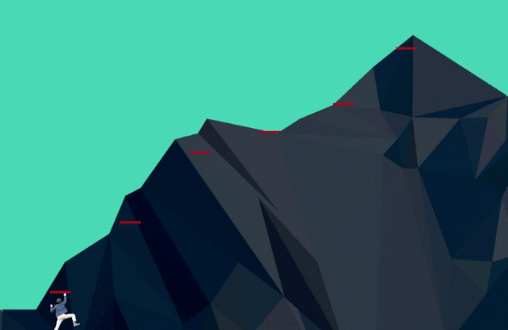

# Elbrus Сlimber 🗻

Итак ты добрался до 3 недели, сдал соло-проект и чувствуешь запах победы над фазой 0. Пришло время покорить свой мини эльбрус. В этом задании тебе нужно написать свою игру, ограничений по геймплею нет 😉 

Можешь усложнять игру как тебе угодно и на сколько хватит фантазии. 

Цель этого задания попрактиковаться в работе с DOM и покодить в свое удовольствие.



## Release 0
#### Базовая разметка

Подготовь  ```html```, ```css``` ,```js ``` файлы и подключи их между собой.

Никаких бэкграундов, только разметка - только хардкор👹🤘

Итак, в этом релизе тебе нужно создать:

    ⭕ игровое поле и поместить туда изображение горы

    ⭕ сделать трасу для нашего альпиниста.
    В альпинизме есть уже размеченные трассы, по которым ориентируются скалолазы.Тебе нужно проделать точно такую же работу, сделать разметку - путь по которому будет перемещаться альпинист. 

    ⭕ поместить скалолаза в начало трассы

Так как мы договорились не использовать ```background-image``` тебе придется повозиться с ```div``` , ```position: realtive ``` и ```position: absolute ```. Картинки ты найдешь в папке ```img```.

## Release 1
#### Слушатель событий
Отлично, теперь навесь слушателя событий на документ и попробуй отловить нажатия на кнопку. Для этого тебе понадобится старый добрый ```eventListner``` и [keydown](https://developer.mozilla.org/ru/docs/Web/API/Element/keydown_event). Давай пока остановимся на двух кнопках(например ```z``` и ```x```) - чтобы твой скалолаз мог двигаться вверх и вниз по меткам. 

Итак, ты отловил события двух кнопок, теперь добавим движения в прямом смысле этого слова и по нажатию на ```x``` скалолаз должен перемещаться к следующей метке, по нажатию на ```z``` назад.

Скорее всего все твои метки имеют что-то общее между собой, благодаря чему их можно вытащить в массивоподобную структуру.А затем перемещаться по ним при помощи индекса.

[appendChild](https://developer.mozilla.org/ru/docs/Web/API/Node/appendChild) тебе поможет в перемещении по меткам.

## Release 2
#### Условия победы

Итак, ты добрался до одной из вершин. Теперь тебе надо поставить флаг на вершину. 
Флаг ты найдешь в папке ```img```.

## Release 3
#### Идеи для реализации и дальнейшая разработка
Поздравляю, ты добрался до вершины. Теперь попробуй прокачать игру, на сколько тебе хватит фантазии. 

Этот релиз опционален, но ведь это так интересно неправда ли? 
Как насчет того, чтобы ввести очки и имя игрока ? 
А что думаешь насчет падающих камней? 
